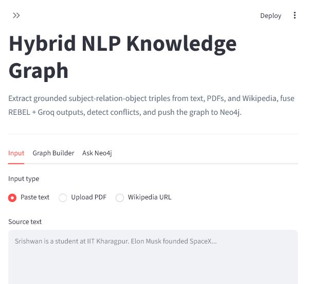
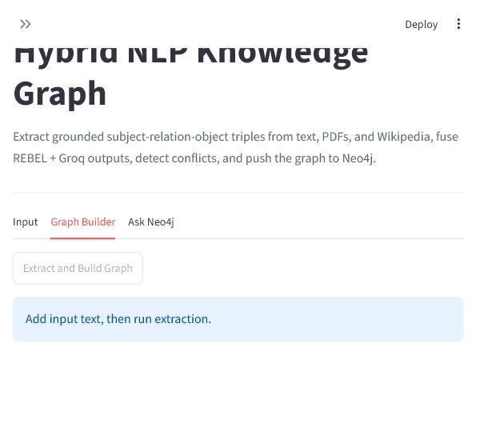
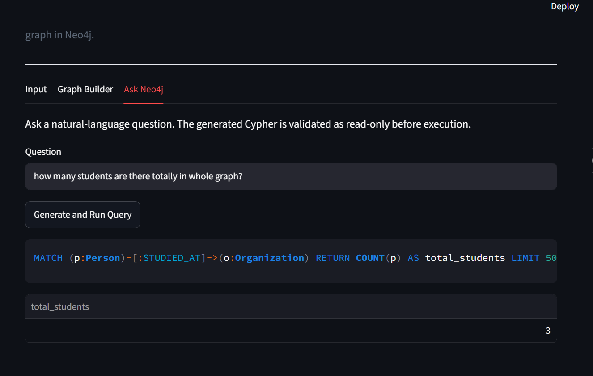

# NLP to Knowledge Graph

A research prototype pipeline that extracts subject-relation-object triples from natural language text and stores them as an explorable Neo4j knowledge graph. Combines three extraction methods — REBEL (seq2seq), Groq Llama 3.1, and a hybrid fusion layer — with lexical grounding and conflict detection.

> **Note:** This is a research prototype. Evaluation is on a manually curated set of 30 sentences. Results may vary with different inputs.

## Architecture

```
Input text / PDF / Wikipedia URL
        |
        v
Preprocessing + sentence splitting + NER + pronoun resolution (spaCy)
        |
        +--> REBEL extractor --------+
        |    (seq2seq relation        |
        |     extraction)             |
        +--> Groq LLM extractor -----+--> Fusion + lexical grounding
             (Llama 3.1-8b)               |
                                          v
                                  Conflict detection
                                          |
                                          v
                             Streamlit UI + Neo4j writer
                                          |
                                          v
                             Safe NL-to-Cypher query layer
```

## Screenshots

Input and configuration:



Graph builder:



Natural language graph querying:



## Features

- **Three extraction methods** — REBEL, Groq LLM, and hybrid fusion
- **Lexical grounding** — rejects hallucinated triples not grounded in source text
- **Fusion layer** — corroborates and boosts confidence when both extractors agree
- **Conflict detection** — flags contradictory claims across sentences
- **Confidence scoring** — per-triple confidence with extractor provenance
- **Interactive UI** — Streamlit frontend with PyVis graph visualization
- **Neo4j persistence** — push triples to a live queryable graph database
- **Natural language querying** — ask questions over the graph with validated read-only Cypher
- **Text, PDF, Wikipedia input** — multiple input sources supported

## Setup

```bash
pip install -r requirements.txt
python -m spacy download en_core_web_lg
```

Create `.env` from `.env.example`:

```
GROQ_API_KEY=your_groq_api_key_here
NEO4J_URI=bolt://localhost:7687
NEO4J_USER=neo4j
NEO4J_PASSWORD=your_neo4j_password_here
```

## Run Neo4j

With Docker:

```bash
docker compose up -d
```

Or use Neo4j Desktop. Neo4j Browser: `http://localhost:7474`

## Run the App

```bash
streamlit run app.py
```

## Demo Inputs

Ready-made demo files in `demo_data/`:

```
demo_data/iit_demo.txt        IIT KGP domain sentences
demo_data/companies_demo.txt  tech company facts
demo_data/scientists_demo.txt famous scientists
demo_data/people_demo.txt     general people facts
```

## Natural Language Graph Querying

Ask questions in plain English — the system converts them to Cypher and runs them on Neo4j.


Example — "how many students are there in the graph?"

```cypher
MATCH (p:Person)-[:STUDIED_AT]->(o:Organization) RETURN COUNT(p) AS total_students LIMIT 50
```

Result: `total_students: 3`

All queries are validated by `cypher_guard.py` — only read-only operations allowed.

## Evaluation

Evaluated on a manually curated set of 30 diverse sentences covering general knowledge, IIT KGP domain, and multi-entity relations. No standardized benchmark exists for hybrid triple extraction pipelines of this type.

Metrics use exact and partial F1 matching with relation canonicalization.

| Method | Precision | Recall | Exact F1 | Partial F1 |
|---|---|---|---|---|
| REBEL | 0.4333 | 0.4333 | 0.4167 | 0.4917 |
| Groq | 0.8833 | 0.8167 | 0.8167 | 0.9333 |
| Hybrid fusion | 0.6028 | 0.8833 | 0.6811 | 0.9333 |

**Observations:**
- REBEL specializes in structured domain-specific relations
- Groq achieves best precision and Exact F1 for general text
- Hybrid fusion achieves highest recall (0.88) by combining both extractors
- Fusion corroboration boosts confidence when both extractors agree on a fact
- Conflict detection flags contradictory claims across sentences

Run evaluation:

```bash
python evaluate_hybrid.py
python evaluate_hybrid.py --verbose
```

Run test suite:

```bash
python Test_pipeline.py --quick
python Test_pipeline.py
```

## Safety

`cypher_guard.py` validates all LLM-generated Cypher before execution. Only `MATCH`, `OPTIONAL MATCH`, `WITH`, `RETURN` are allowed. Write operations are blocked.

## Project Files

```
app.py                 Streamlit frontend
NLP_pipeline.py        REBEL + spaCy extraction pipeline
groq_extractor.py      Groq extractor and fusion layer
conflict_detector.py   Conflict detection
cypher_guard.py        Read-only Cypher validator
evaluate_hybrid.py     Three-method benchmark
Test_pipeline.py       Pipeline and unit tests
main_neo4j.py          CLI pipeline runner
docker-compose.yml     Local Neo4j service
.env.example           Configuration template
PROJECT_HIGHLIGHTS.md  Interview talking points
```

## Tech Stack

- **REBEL** (Babelscape/rebel-large) — seq2seq relation extraction
- **Groq + Llama 3.1-8b** — LLM triple extraction
- **spaCy en_core_web_lg** — NER, sentence segmentation, dependency parsing, pronoun resolution
- **Neo4j** — graph database
- **Streamlit + PyVis** — frontend and graph visualization
- **SentenceTransformers** — semantic evaluation

## Resume Bullet

Built an NLP-to-Knowledge-Graph pipeline using REBEL, Groq Llama, spaCy, and Neo4j, comparing three extraction methods with confidence scoring, conflict detection, graph visualization, and NL querying — achieving 0.93 Partial F1 on a curated evaluation set.